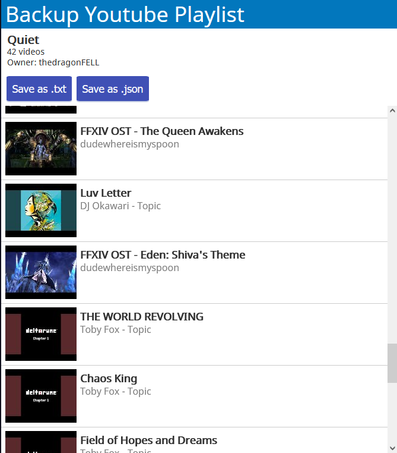
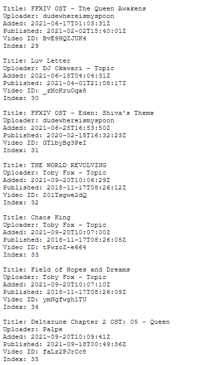

# yt-savelist

Hosted on [sjungq.com/backup](http://sjungq.com/backup).

Small web application to take text/json backups of Youtube playlists, utilizing the Youtube Data API. Written to get around the classic issue of going through several-years-old personal Youtube playlists and finding that a hefty chunk of videos have been removed, with no clue remaining as to what the video was of or about.

Supply a full Youtube playlist URL or Youtube playlist ID to create a text/json list of playlist videos.

 

Written with JS (Node, Express, Axios), SCSS, and EJS for templating. Example hosted through DigitalOcean.
